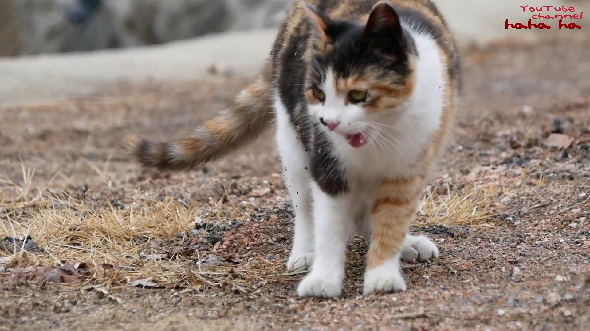

# 마크다운

- (#) 제목을 표현하는 마크다운 태그다
- (-, *) 순서가 없는 리스트 표현
- (1,2,3) 순서가 있는 리스트 표현
- (` `) 코드블럭:  ``` java System.out.prnitln("java");	```
- 스트링으로 링크 삽입:  [google](www.google.com)
- 이미지 삽입: 


​				! assets 에 이미지를 넣어둬서 본래 이미지의 경로가 바뀌어도 영향 받지 않음 !

* **볼드: 별표 두개를 양 옆**

* *이탤릭: 별표 한개 양 옆*

* ~~취소선: 물결표시 두개 양 옆~~

* 하이픈 세개(하단 참고)

  ---

  

* 인용문: 오른쪽 화살표(하단 참고)

  > 인용문
  >
  > ㅇㅇㅇㅇㅇㅇ

* | 분류 | 고양이 |
  | ---- | ------ |
  | 특성 | ㅇㅇㅇ |
  | 성격 | ㅇㅇㅇ |
  | 먹이 | ㅇㅇㅇ |
  | 나이 | ㅇㅇㅇ |

  

